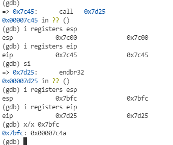
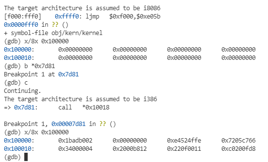
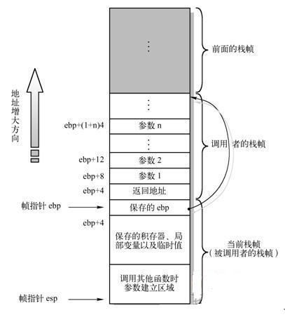

# 实验一


## 第一部分 PC的启动
整个使用都运行在QEMU模拟器上，该模拟器可以每行调试代码，比较方便的观察到整个系统的启动情况，以及操作系统做了啥；
### 练习1
    首先告诉你该练习目的是要你熟悉汇编语言、PC启动过程、和QEMU模拟器的调试过程。没什么实质的内容，直接下一个

### PC的物理地址空间
在早期的PC中，CPU是16bits的8088处理器，只支持访问1MB的物理内存，物理地址空间从0x00000000到0x000FFFFF而不是0xFFFFFFFF,低640KB的空间被标记为low memory，作为RAM使用；  

从0x000A0000到0x00FFFFF，被保留作为硬件外设，比如VGA的缓冲区，这个区域保留着最重要的BIOS（基本输入输出系统），占64KB从0x000FF0000开始，到0x000FFFFFF，早期的PC中，BIOS是只读的，现在BIOS都存在FLash中，是可以多次写入的，BIOS的主要功能是系统的基本初始化，包括显卡、内存大小。在这些初始化之后，BIOS将从硬盘中加载操作系统；

```

+------------------+  <- 0xFFFFFFFF (4GB)
|      32-bit      |
|  memory mapped   |
|     devices      |
|                  |
/\/\/\/\/\/\/\/\/\/\

/\/\/\/\/\/\/\/\/\/\
|                  |
|      Unused      |
|                  |
+------------------+  <- depends on amount of RAM
|                  |
|                  |
| Extended Memory  |
|                  |
|                  |
+------------------+  <- 0x00100000 (1MB)
|     BIOS ROM     |
+------------------+  <- 0x000F0000 (960KB)
|  16-bit devices, |
|  expansion ROMs  |
+------------------+  <- 0x000C0000 (768KB)
|   VGA Display    |
+------------------+  <- 0x000A0000 (640KB)
|                  |
|    Low Memory    |
|                  |
+------------------+  <- 0x00000000

```

虽然CPU的支持更大的寻址空间，为了兼容之前写的BIOS，前1MB的物理地址的布局还是被保留了下来；

### ROM中的BIOS
这一小节，要用gdb调试BIOS启动过程；

tu   
可以看到第一条指令就是
```
[f000:fff0]    0xffff0: ljmp   $0xf000,$0xe05b
```
从打印的指令可以看到：  
* 首先PC在物理地址0x000ffff0的位置启动，这在BIOS的存储Rom中是非常高的位置；
* 启动时的状态是 CS = 0xf000（代码段寄存器） IP = 0xfff0(指令指针寄存器)；
* 第一条指令是jmp指令，将CS = 0xf000, IP = 0xe05b；  
首先这个物理地址0x000ffff0是一个固定值，不过为什么放在这个高的位置，是一个问题，其次，ROM如何映射到这个地址，也是一个问题；
接下来就是对CPU寻址模式的一个解释：总的来说
```
物理地址 =  代码段地址 << 4 + 指令指针寄存器偏移量
```
为什么要这样做？因为此时CPU还是16bits寻址空间，数据总线是8bits，纯按这个方式寻址，最大的寻址空间是2^16 * 1 = 64KB，可是当前状态的CPU可以用的物理内存有1MB，需要20bits的寄存器，于是用这样一个段 + 偏移量的形式，避免了实际可用内存大于寻址空间的问题。  

### 练习二
    使用GDB跟踪几条指令，猜测BIOS在干吗，其实也没实际的内容；

## 第二部分 Boot loader
对于PC来说，硬盘被划分为512byte的区域，叫做扇区，扇区是一次磁盘操作的最小区域，如果该磁盘是可启动的，该磁盘第一个扇区叫做启动扇区，也就是bootloader代码的存储区域。当BIOS找到这个可以启动的扇区时，他将这个512byte扇区的内容加在到0x7c00到0x7dff，然后通过`jmp CS:IP`指令调到这个区域，此时就完成的BIOS到BootLoader的转换，这些地址就像BIOS启动区域一样，都是人为自由规定的，但是对PC来说，是固定的；  
在6.828的实验中，Bootloader包括一个汇编源文件boot/boot.S，与.c文件 boot/main.c, BootLoader的主要目的有两个：
* 将处理器从实模式切换到32bits的保护模式，这两者的主要区别给出的参考资料中有介绍，主要是寻址空间从1MB扩展到4GB，其次是引入了虚拟内存的分页内存机制；
* Bootloader通过x86的特定IO指令，将内核从磁盘中读取出来；  
当你看懂了bootloader的源码之后，看看obj/boot/boot.asm文件，该文件是bootloader的反汇编文件，阅读反汇编文件可以更加清晰的看到boot loader的代码所在位置，同样对于obj/kern/kernal.asm

### 练习三
    设立一个断点在0x7c00,也就是bootloader所在的启动扇区的位置，继续执行直到命中这个断点，跟踪boot.s的代码，也可以使用GDB的x/i指令去获取任意机器指令的反汇编指令，对比boot.s与boot.asm的内容。

    追踪到bootmain函数中，具体到readsect()函数中，将汇编指令与C语言代码进行对应，回到bootmian函数中，找到内核文件从磁盘读取到内存的for循环代码，并找到循环结束后执行的语句，并再这位置设置断点，运行到该断点，然后跟踪直到bootloader结束

要回答以下四个问题：
1. 处理器从什么时候开始执行 32 位代码？究竟是什么导致从16位模式切换到32位模式？
2. bootloader最后一条执行的指令是那个？ kernal执行的第一条指令是？
3. 内核执行的第一条指令在哪里？
4. bootloader怎么直到他要读取多少个扇区才能吧内核加载到内存，这些信息在哪里可以找到？

先看练习三，汇报代码注释其实已经写的比较详细了
```
.globl start
start:
  .code16                     # Assemble for 16-bit mode
  cli                         # Disable interrupts 关中断
  cld                         # String operations increment 

  # Set up the important data segment registers (DS, ES, SS).
  xorw    %ax,%ax             # Segment number zero ax寄存器清零
  movw    %ax,%ds             # -> Data Segment  用ax寄存器清零DS ES SS寄存器
  movw    %ax,%es             # -> Extra Segment
  movw    %ax,%ss             # -> Stack Segment
```
这几条指令主要是关闭中断，清理了DS ES SS寄存器的值；  
```
  # Enable A20:
  #   For backwards compatibility with the earliest PCs, physical
  #   address line 20 is tied low, so that addresses higher than
  #   1MB wrap around to zero by default.  This code undoes this.
seta20.1:
  inb     $0x64,%al               # Wait for not busy
  testb   $0x2,%al
  jnz     seta20.1

  movb    $0xd1,%al               # 0xd1 -> port 0x64
  outb    %al,$0x64

seta20.2:
  inb     $0x64,%al               # Wait for not busy
  testb   $0x2,%al
  jnz     seta20.2

  movb    $0xdf,%al               # 0xdf -> port 0x60
  outb    %al,$0x60
  ```
可以看到seta20.1是一个轮询的过程，一直查询的是0x64里面的第二个bit位是否是0，inb指令是直接从硬件IO口上读取数据，这里是将0x64的IO口，读取到al寄存器中，test指令做得就是and操作， 一个数与上0x02查询的就是第1个bit位是否1，若为1，ZF寄存器就是1，jnz是jump not zero的意思，直到ZF寄存器是0，才跳出这个循环；  
接下来是通过out指令将0xd1送到地址为0x64的IO端口中; 告诉cpu，下一行命令写到0x60寄存器，并且要被写到804x输出端口上，后续操作与之前相同，再次查询0x64的bit1位是否为1，也就是查询数据写入是否成功，如果成功，接下来就再向0x60口，写入0xdf；
具体含义参考这个网站：https://bochs.sourceforge.io/techspec/PORTS.LST   
接下来代码：
```
  # Switch from real to protected mode, using a bootstrap GDT
  # and segment translation that makes virtual addresses 
  # identical to their physical addresses, so that the 
  # effective memory map does not change during the switch.
  lgdt    gdtdesc
  movl    %cr0, %eax
  orl     $CR0_PE_ON, %eax
  movl    %eax, %cr0

  # Bootstrap GDT
  .p2align 2                                # force 4 byte alignment
  gdt:
    SEG_NULL				# null seg
    SEG(STA_X|STA_R, 0x0, 0xffffffff)	# code seg
    SEG(STA_W, 0x0, 0xffffffff)	        # data seg

  gdtdesc:
    .word   0x17                            # sizeof(gdt) - 1
    .long   gdt                             # address gdt
```

#### GDT表
接下来就是一个比较重要的概念了：gdt（global Descriptor Table 全局描述表），它是一种结构体数据，被用于定义内存分段，比如，代码段，数据段。对不同的段限制其相应的操作限制，也就是rwx；  
从代码中看到，他先使用指令lgdt，将gdtdesc地址存到全局描述表寄存器中；这条指令的功能就是把关于GDT表的一些重要信息存放到CPU的GDTR寄存器中，其中包括GDT表的内存起始地址，以及GDT表的长度。这个寄存器由48位组成，其中低16位表示该表长度，高32位表该表在内存中的起始地址。所以gdtdesc是一个标识符，标识着一个内存地址。从这个内存地址开始之后的6个字节中存放着GDT表的最后一个位置的偏移量和起始地址。我们可以在这个文件的末尾看到gdtdesc；  
gdt表中包含三个种类，nullseg、codeseg、dataseg，xv6没有分段机制，代码段与数据段都是放在一起的，都可以使用0x00到0xffffffff = 4G内存;
那么这三种类有什么不同，这里是通过宏定义SEG（在inc/mmu.h中）来初始化，主要包括读、写、执行权限，存储的起始地址与最大地址；

在初始化gdt后，后续的几条指令就很简单了，把寄存器CR0的值取出来，逻辑或0x01，再写入CR0中，在inc/mmu.h中，该值就是启动保护模式的意思；  

后续执行的就是32位模式的跳转工作，跳转到保护模式下的代码段，IP寄存器直接指向标志符protcseg，再使用数据段初始化其余段寄存器，包括DS、SS等寄存器；  
```
  # Jump to next instruction, but in 32-bit code segment.
  # Switches processor into 32-bit mode.
  ljmp    $PROT_MODE_CSEG, $protcseg

  .code32                     # Assemble for 32-bit mode
protcseg:
  # Set up the protected-mode data segment registers
  movw    $PROT_MODE_DSEG, %ax    # Our data segment selector
  movw    %ax, %ds                # -> DS: Data Segment
  movw    %ax, %es                # -> ES: Extra Segment
  movw    %ax, %fs                # -> FS
  movw    %ax, %gs                # -> GS
  movw    %ax, %ss                # -> SS: Stack Segment
  
  # Set up the stack pointer and call into C.
  movl    $start, %esp
  call bootmain
```
在boot.s最后，使用call指令，调用bootmain函数，在反汇编文件obj/boot/boot.asm中可以看到，函数名就是一个指令地址，调用前后的esp、eip地址对比如下图,调用前，eip指向是当前指令地址，执行call之后，栈中被推入了`call bootmain` 下一条指令的地址，作为函数返回地址，同时在新函数的开头，更新ebp的值，`push %esp, mov %esp, %ebp`作为被调用函数的栈顶,以上就是一般函数调用的过程;  



```
	readseg((uint32_t) ELFHDR, SECTSIZE*8, 0);
    7d2e:	52                   	push   %edx
    7d2f:	6a 00                	push   $0x0
    7d31:	68 00 10 00 00       	push   $0x1000
    7d36:	68 00 00 01 00       	push   $0x10000
    7d3b:	e8 a2 ff ff ff       	call   7ce2 <readseg>
```
readseg(),前面三条指令是形参的初始化，这里就可以看到，形参的初始化顺序是从后往前初始化的，且是由调用者进行初始化，接下来就进入readseg函数中，bootmain主要的流程，先读一个page，也就是4096个字节，首先校验ELF的magic是否正确，如果正确就从该结构体中的另一个成员中读到起始地址与大小，然后调用readseg函数从磁盘中加载内核，然后将entry这个成员作为函数指针进行调用，此时已经进行操作系统内核；  

这小节后续还需要再细化分析；

### 小总结
这部分练习内容，主要是要你理解一下bootloader的主要工作，那么现在可以主要总结一下，BootLoader的主要工作包括：
* CPU的工作模式从实模式到保护模式的切换；由于现在还没有MMU，主要是通过GDT进行读、写、执行的权限管理，目前保护模式只区分了代码段与数据段，也没有在内存中将其区分，这部分对应的代码是boot.s部分；
* 从硬盘指定的地址将内核加载到内存中，具体方式是，先读4096个字节，这其中就包括内核一些信息，包括magicnum（校验数字）、内核起始地址，大小等，如果校验成功，根据这些信息从硬盘中读取一定数量的字节加载到内存，读取完毕之后，通过elf结构体中的entry这个函数入口进入操作系统的内核，由此进入了操作系统内核；


### 加载内核

#### 练习四
    C语言学习，在书中《The C Programming Language》中，阅读5.1到5.5节。然后下载pointers.c的代码，并且编译运行它，确保你理解在屏幕上打印出来的所有的值是怎么来的。尤其要重点理解第1行，第6行的指针地址是如何得到的，以及在第2行到第4行的值是如何得到的，还有为什么在第5行打印出来的值看起来像程序崩溃了。

这里首先介绍了一下ELF文件，参考https://en.wikipedia.org/wiki/Executable_and_Linkable_Format，或者直接在inc/elf.h中的struct可以看到该类文件的固定长度的elf头，其中包括elf文件的分段方式，包括.text段、.rodata段、.data段、.bss段等，具体可以参考https://zhuanlan.zhihu.com/p/348026261；  

#### 练习五
    在boot/Makefrag文件中，修改链接地址，使用GDB追踪修改链接后的BootLoader，看看是否有问题；
这里大概涉及到的是重定向的知识，暂时不太明白；  


#### 练习六
    这个练习中，需要将尝试使用GDB的x命令（查看内存命令）。 x/Nx ADDR。这个指令将打印出从ADDR地址开始之后的N个字的内容。重启一下Qemu。在Bios进入boot loader之前，内存地址0x00100000处8个字的内容，然后进入boot loader运行到内核开始处停止，再看下这个地址处的值。为什么二者不同？第二次这个内存处所存放的值的含义是什么？

首先内核程序的入口地址是0x1000c,这点可以使用`objdump -f obj/kern/kernel`可以得到内核程序的入口；  
实验结果如下图：  
  
可以看到刚进入bootloader，内存地址0x100000之后存的都是0，运行到内核入口之前，内存地址存的值已经不是0了，从`obj/kern/kernel.asm`中可以看到，这个已经是内核的代码段的内容了，在bootloader将内核加载到内存之后，这个内存的值已经得到了修改；  


## 第三部分 内核
在之前的objdump的练习中，已经看到了VMA与LMA的不同，也就是加载地址与链接地址的不同，这里我们需要深入探究一下；

### 使用虚拟地址空间
#### 练习7
    使用GDB跟踪内核代码，停在`movl %eax, %cr0`，查看内存0x00100000与0xf0100000，执行完这条语句后，再次查看这两个内存,解释一下为什么是这个样子的

这条语句就是启动内存映射的一个地址，在此之前内核还未建立起内存映射关系，在此之后，建立了内存映射关系，两个地址被映射到相同的物理地址中,具体如何实现看下反汇编代码：
```
	# sufficient until we set up our real page table in mem_init
	# in lab 2.

	# Load the physical address of entry_pgdir into cr3.  entry_pgdir
	# is defined in entrypgdir.c.
	movl	$(RELOC(entry_pgdir)), %eax
f0100015:	b8 00 90 11 00       	mov    $0x119000,%eax
	movl	%eax, %cr3
f010001a:	0f 22 d8             	mov    %eax,%cr3
	# Turn on paging.
	movl	%cr0, %eax
f010001d:	0f 20 c0             	mov    %cr0,%eax
	orl	$(CR0_PE|CR0_PG|CR0_WP), %eax
f0100020:	0d 01 00 01 80       	or     $0x80010001,%eax
	movl	%eax, %cr0
f0100025:	0f 22 c0             	mov    %eax,%cr0

	# Now paging is enabled, but we're still running at a low EIP
	# (why is this okay?).  Jump up above KERNBASE before entering
	# C code.
	mov	$relocated, %eax
f0100028:	b8 2f 00 10 f0       	mov    $0xf010002f,%eax
	jmp	*%eax
f010002d:	ff e0                	jmp    *%eax

f010002f <relocated>:
relocated:

	# Clear the frame pointer register (EBP)
	# so that once we get into debugging C code,
	# stack backtraces will be terminated properly.
	movl	$0x0,%ebp			# nuke frame pointer
```
总的来说，先把entry_dir的地址存到cr3寄存器中作为一级页表，然后在启动内存映射模式，这里有个小问题，就是启动内存映射模式后，EIP如何还能正确被映射到指向下一个指令：
```
__attribute__((__aligned__(PGSIZE)))
pde_t entry_pgdir[NPDENTRIES] = {
	// Map VA's [0, 4MB) to PA's [0, 4MB)
	[0]
		= ((uintptr_t)entry_pgtable - KERNBASE) + PTE_P,
	// Map VA's [KERNBASE, KERNBASE+4MB) to PA's [0, 4MB)
	[KERNBASE>>PDXSHIFT]
		= ((uintptr_t)entry_pgtable - KERNBASE) + PTE_P + PTE_W
};
```
由虚拟内存的地址机制，高10位是entry_pgdir的偏移量，这个entry_pgdir只初始化了两个内容，entry_pgdir[0]与entry_pgdir[960]，正好对应的是0x00100028与0xf0100028中高10位数值，他们内容（除了权限问题之外）是一样的，说明这两个一级页表映射的地址区间是同一个page，于是EIP的虚拟内存映射之后，地址没有变化，如同entry_pgdir注释所示；  


### 格式化打印至控制台

### 练习8
    补全printf()函数的%o的情况
还需要回答这些问题：
1. 解释`printf.c`与`console.c`，特别是`console.c`那些函数被导出，他们是怎么被`printf.c`调用？
2. 解释`console.c`中的下列语句的含义：
```
  if (crt_pos >= CRT_SIZE) {
        int i;
        memmove(crt_buf, crt_buf + CRT_COLS, (CRT_SIZE - CRT_COLS) * sizeof(uint16_t));
        for (i = CRT_SIZE - CRT_COLS; i < CRT_SIZE; i++)
                crt_buf[i] = 0x0700 | ' ';
          crt_pos -= CRT_COLS;
  }
```
3. 跟踪以下代码
```
int x = 1, y = 3, z = 4;
cprintf("x %d, y %x, z %d\n", x, y, z);
```

4. 执行以下代码
```
  unsigned int i = 0x00646c72;
  cprintf("H%x Wo%s", 57616, &i);
```
输出的的字符是啥，为什么？
5. `cprintf("x=%d y=%d", 3);`输出是啥，为什么？

6. 假设GCC的形参默认初始化顺序是，从左到右，如何更改cprintf函数的接口，以便于可变数量的参数传递给该函数;


这个练习很简单，直接将%u系列的复制下来，将base改成8就可以；
```
case 'o':
  num = getint(&ap, lflag);
  base = 8;
  goto number;
```
接下来回答问题:  
1. 从代码中就可以看到，从函数printf.c中通过函数指针调用putch()，而putch函数中调用cputchar函数是console.c中的函数接口，用于输出一个字符串；

2. 这段代码的主要目的是，如果屏幕的字符串长度大于显示的最大字符串，首先使用memmove将整体将buf前移动一行（宏定义为80 * 2个字节），这里必须使用memmove，因为内存区域是有重叠的，memcpy会导致数据错误的，然后将最后一行的数据用空格填充，将当前字符串位置减去一行大小；

3. 这里其实是考察GCC默认的形参初始化方式，从汇编代码来看，默认的形参初始化方式是从右往左进行入栈初始化的,并且可以看到指针操作的具体是通过lea命令进行实现的；
```
	//lab1 exercise 8
	int x = 1, y = 3, z = 4;
	cprintf("x %d, y %x, z %d\n", x, y, z);
f01000f0:	6a 04                	push   $0x4
f01000f2:	6a 03                	push   $0x3
f01000f4:	6a 01                	push   $0x1
f01000f6:	8d 83 6a 08 ff ff    	lea    -0xf796(%ebx),%eax
f01000fc:	50                   	push   %eax
f01000fd:	e8 9b 09 00 00       	call   f0100a9d <cprintf>
```
4. 跑出来的效果是
```
x 1, y 3, z 4
He110 World
x=3 y=-267321364
```
57616的16进制就是110，这个没啥好说的，关键是0x00646c72按照%s打印是rld，这个就涉及到计算机的存储形式了，计算机按照小端序列进行存储，也就是说i = 0x00646c72实际存储方式，地址从低到高分别是72 6c 64 00形式,其ASC码值对应就是字符串"rld\0"，所以打印出来为He110 World了；

5. y=之后打印出来的数字是之前栈中使用的数字，但是并无实际意义，这个问题是告诉你，printf对于参数缺省的情况下的实际运行情况与原理；

6. 这种情况只能声明一个参数数量这个变量；（函数可变数量形参这里还要继续看）


#### 栈

#### 练习9
    找到哪里是内核初始化的代码，内核的栈起点在哪里，内核栈的保留的区域的终点在哪里？

ebp（基指针）寄存器主要通过软件习惯与堆栈相关联。 在进入 C 函数时，函数会更新ebp的地址，表示这里才是该函数栈的起点，那么在程序执行期间的任何变量，都可以通过跟踪保存的ebp要到达的程序中的点。 此功能可能特别有用，例如，当某个特定函数由于传递了错误参数而导致异常时，但您不确定是谁传递了错误参数。堆栈回溯可让您找到有问题的函数。

回答：
内核初始化栈是是entry.S中语句
```
movl	$0x0,%ebp			# nuke frame pointer
# Set the stack pointer
movl	$(bootstacktop),%esp
```
栈的大小在`inc/memlayout.h`中定义为8 * 4096大小，也就是32KB；（目前还不确定是为什么ebp在0x00，esp大于ebp）

#### 练习10
    为了熟悉C语言调用函数的规则，找到test_backtrace函数，设一个断点，检验每次调用这个函数时，每层嵌套有有多少个32bits字段被推入栈中，这些字段代表什么意思？
这个实验只需要在test_backtrace()函数中打印出ebp与esp的值就行了，打印结果为：   
```
entering test_backtrace 5
ebp = 0xf010ffd8, esp = 0xf010ffc0
entering test_backtrace 4
ebp = 0xf010ffb8, esp = 0xf010ffa0
entering test_backtrace 3
ebp = 0xf010ff98, esp = 0xf010ff80
entering test_backtrace 2
ebp = 0xf010ff78, esp = 0xf010ff60
entering test_backtrace 1
ebp = 0xf010ff58, esp = 0xf010ff40
entering test_backtrace 0
ebp = 0xf010ff38, esp = 0xf010ff20
```
可以看到每次进行函数调用压栈的32bits的字段为32个,其中函数栈帧中，从上到下分别是，临时变量，调用其他函数的形参，调用返回值，函数调用者的ebp地址；  

#### 练习11
    完成一个回溯函数，打印ebp、eip和形参值，eip存的是函数返回指令指针，也就是函数返回时将要接管的指令地址，这个值通常指向call指令的下一条指令，为什么？最后，五个十六进制数字，那些是在函数调用前应该被压入栈中的，如果函数形参少于五个呢？（为什么回溯函数不能知道到底有几个形参，这样的局限性应该怎么样被修复）
需要补全的是mon_backtrace函数，主要的问题在于，循环的结束条件吧，读取ebp值可以直接使用read_ebp函数，根据上一个练习的结果，eip的存储地址就是当前函数ebp + 1存储地址，再接着往上就是所用的形参了，此时需要一直回溯到内核启动的函数，也就是第一次设置ebp函数，在练习9中知道第一次设置ebp为0x00；(为什么要保存调用者的ebp的值，只是为了调试还是其他的目的)  
  
其次，这里的read_ebp函数被声明为inline函数，从汇编上可以看到，inline函数没有使用call命令，而是就地修改了代码，避免了函数调用的开销（形参入栈，eip入栈，局部变量等）；  
```
int
mon_backtrace(int argc, char **argv, struct Trapframe *tf)
{
	// Your code here.
	cprintf("Stack backtrace:\n");
	for (uint32_t ebp = read_ebp(); ebp != 0x00 ; ebp = *((uint32_t *)ebp)){
		cprintf("  ebp %08x eip %08x  args %08x %08x %08x %08x %08x\n", 
		ebp, *((uint32_t *)ebp + 1), *((uint32_t *)ebp + 2), *((uint32_t *)ebp + 3), 
		*((uint32_t *)ebp + 4), *((uint32_t *)ebp + 5), *((uint32_t *)ebp + 6));
	}
	return 0;
}
```

#### 练习12
    修改栈的回溯函数，对每个eip，找到他的函数名称，源文件名称，行数。
    在debuginfo_eip，__STAB_*从哪里来，这个问题先不考虑。现在要完成debuginfo_eip函数，通过二分查找函数stab_binsearch函数找到函数行号；
    在你的操作系统中加入backtrace命令，并且实现mon_backtrace函数，调用debuginfo_eip，打印按照固定的格式打印每个栈帧：
    K> backtrace
    Stack backtrace:
      ebp f010ff78  eip f01008ae  args 00000001 f010ff8c 00000000 f0110580 00000000
            kern/monitor.c:143: monitor+106
      ebp f010ffd8  eip f0100193  args 00000000 00001aac 00000660 00000000 00000000
            kern/init.c:49: i386_init+59
      ebp f010fff8  eip f010003d  args 00000000 00000000 0000ffff 10cf9a00 0000ffff
            kern/entry.S:70: <unknown>+0
    K>
    每行栈帧的eip的文件名字，与行号，接着给出函数名称，和eip相对该函数首条指令的偏移量(monitor+106表示eip相对于monitor函数首行有106字节的偏移量)
    tip：打印字符串的前n个字符可以使用printf("%.*s", length, string)

这个练习中debuginfo_eip是copy的：
```
  stab_binsearch(stabs, &lline, &rline, N_SLINE, addr);
	if (lline <= rline){
		info->eip_line = stabs[lline].n_desc;
	}else{
		cprintf("line not find\n");
	}
```
后续的mon_backtrace函数直接每次调用debuginfo_eip函数，再将信息打印出来即可：
```
int
mon_backtrace(int argc, char **argv, struct Trapframe *tf)
{
	// Your code here.
	cprintf("Stack backtrace:\n");
	for (uint32_t ebp = read_ebp(); ebp != 0x00 ; ebp = *((uint32_t *)ebp)){
		uint32_t eipAddr = *((uint32_t *)ebp + 1);
		cprintf("  ebp %08x eip %08x  args %08x %08x %08x %08x %08x\n", 
		ebp, eipAddr, *((uint32_t *)ebp + 2), *((uint32_t *)ebp + 3), 
		*((uint32_t *)ebp + 4), *((uint32_t *)ebp + 5), *((uint32_t *)ebp + 6));
		struct Eipdebuginfo info;
		debuginfo_eip(eipAddr, &info);
		cprintf("         %s:%d: %.*s+%d\n", info.eip_file, info.eip_line, info.eip_fn_namelen, info.eip_fn_name, eipAddr - info.eip_fn_addr);
		
	}
	
	return 0;
}
```
最后加入新的命令需要看明白monitor函数与runcmd函数，monitor函数每次都从命令行中读取数据，调用runcmd函数，runcmd其实就是做了一个字符串匹配的工作，匹配从静态结构体数组中`static struct Command commands[] `匹配函数名，argc argv等变量，再通过该结构体数组中的函数指针调用该函数，弄清楚这个，加入新的命令就很简单了，就是在这个数组中加入函数名称、描述，以及指向对应函数的指针；  
至此，lab1总算是磕磕绊绊的做完了。


# 总结
总的来说，lab1做完了解到很多知识，比较有用的是汇编语句（可以再看一遍csapp）、系统栈的管理方式（包括回溯的汇编代码的实现），函数调用规则，包括页表的建立与原理，还没弄明白的是链接与重定向的方面的内容：下图是这个实验主要内容--PC启动的大致总结。  


    


# 网上找到的资料记录一下
* https://www.cnblogs.com/fatsheep9146/category/769143.html


* 全局描述表
https://zh.wikipedia.org/wiki/%E5%85%A8%E5%B1%80%E6%8F%8F%E8%BF%B0%E7%AC%A6%E8%A1%A8   https://www.geeksforgeeks.org/what-is-global-descriptor-table/  https://wiki.osdev.org/Global_Descriptor_Table https://en.wikibooks.org/wiki/X86_Assembly/Global_Descriptor_Table

* 函数调用
https://www.tutorialspoint.com/assembly_programming/assembly_procedures.htm  https://zhuanlan.zhihu.com/p/24129384  https://blog.csdn.net/theLostLamb/article/details/79950815  https://segmentfault.com/a/1190000016661251

* 页表
https://en.wikipedia.org/wiki/Control_register  https://pdos.csail.mit.edu/6.828/2018/readings/i386/s05_02.htm