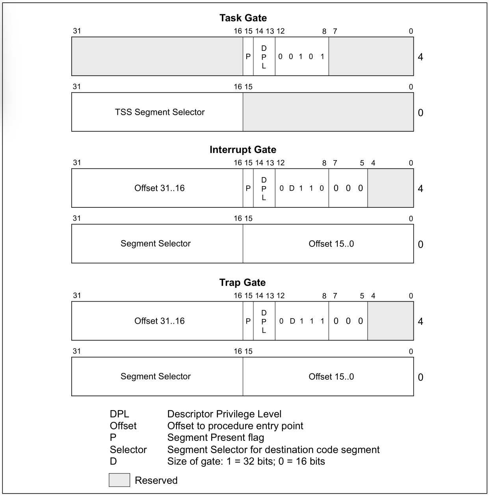

# lab3 用户环境

在这个实验中，我们将实现操作系统的一些基本功能，来实现用户环境下的进程的正常运行。你将会加强JOS内核的功能，为它增添一些重要的数据结构，用来记录用户进程环境的一些信息；创建一个单一的用户环境，并且加载一个程序运行它。你也可以让JOS内核能够完成用户环境所作出的任何系统调用，以及处理用户环境产生的各种异常。

## PART A:用户环境与异常处理
新包含的文件'inc/env.h'包含了用户环境的基本定义，内核使用Env数据结构，追踪每个用户环境，在这个实验中，你会初始化一个环境，但是你需要设计JOS内核支持多个用户环境，在lab4会使用这个特性允许一个用户环境fork其他用户环境。   
在'kern/env.c'，内核维护三个全局变量环境：
```
struct Env *envs = NULL;		// All environments
struct Env *curenv = NULL;		// The current env
static struct Env *env_free_list;	// Free environment list
```
一旦JOS启动，envs指针便指向了一个 Env 结构体链表，表示系统中所有的用户环境的env。在我们的设计中，JOS内核将支持同一时刻最多 NENV 个活跃的用户环境，尽管这个数字要比真实情况下任意给定时刻的活跃用户环境数要多很多。系统会为每一个活跃的用户环境在envs链表中维护一个 Env 结构体。  
同时JOS内核会将没有用到env结构的中，用env_free_list的链表进行管理,这种设计方便用户环境env分配与回收。  
内核会把curenv指针指向正在执行的Env结构体，没有用户环境时，curenv = NULL。  
###  环境状态
　　我们要看一下，Env结构体每一个字段的具体含义是什么，Env结构体定义在 inc/env.h 文件中
```
　　struct Env {
　　　　struct Trapframe env_tf;      //saved registers
　　　　struct Env * env_link;         //next free Env
　　　　envid_t env_id;　　            //Unique environment identifier
　　　　envid_t env_parent_id;        //envid of this env's parent
　　　　enum EnvType env_type;　　//Indicates special system environment
　　　　unsigned env_status;　　   //Status of the environment
　　　　uint32_t env_runs;         //Number of the times environment has run
　　　　pde_t *env_pgdir;　　　　//Kernel virtual address of page dir.
　　};　　
```
env_tf:  
这个类型的结构体在'inc/trap.h'文件中被定义，里面存放着当用户环境暂停运行时，所有重要寄存器的值。内核也会在系统从用户态切换到内核态时保存这些值，这样的话用户环境可以在之后被恢复，继续执行。  
env_link:  
这个指针指向下一个在env_free_list的环境，env_free_list链表指向第一空闲的环境。  
env_id:   
内核对当前使用的环境有一个独有的id，标识特定的envs数组的索引值，在一个用户环境终止时，内核可能将这个结构体重新分配给其他不同的环境，但是新的环境会有不同的env_id，尽管他们使用的是相同的内存索引值。  
env_parent_id:   
创建这个用户环境的父用户环境的env_id   
env_type:   
    用于区别出来某个特定的用户环境。对于大多数环境来说，它的值都是ENV_TYPE_USER   
env_status:   
这个变量存放以下可能的值   
ENV_FREE: 代表这个结构体是不活跃的，应该在链表env_free_list中。   
ENV_RUNNABLE: 代表这个结构体对应的用户环境已经就绪，等待被分配处理机。   
ENV_RUNNING: 代表这个结构体对应的用户环境正在运行。   
ENV_NOT_RUNNABLE: 代表这个结构体所代表的是一个活跃的用户环境，但是它不能被调度运行，因为它在等待其他环境传递给它的消息。   
ENV_DYING: 代表这个结构体对应的是一个僵尸环境。一个僵尸环境在下一次陷入内核时会被释放回收。    
env_pgdir:
    这个变量存放着这个环境的页目录的虚拟地址

就像Unix中的进程一样，一个JOS环境中结合了“线程”和“地址空间”的概念。线程通常是由被保存的寄存器的值来定义的，而地址空间则是由env_pgdir所指向的页目录表还有页表来定义的。为了运行一个用户环境，内核必须设置合适的寄存器的值以及合适的地址空间


### 分配用户环境数组
　在lab 2，你在mem_init() 函数中分配了pages数组的地址空间，用于记录内核中所有的页的信息。现在你需要进一步去修改mem_init()函数，来分配一个Env结构体数组，叫做envs。

#### Exercise 1 
    修改一下mem_init()的代码，让它能够分配envs数组。这个数组是由NENV个Env结构体组成的。envs数组所在的这部分内存空间也应该是用户模式只读的。被映射到虚拟地址UENVS处。
```
void
mem_init(void)
{
	uint32_t cr0;
	size_t n;

	// Find out how much memory the machine has (npages & npages_basemem).
	i386_detect_memory();

	// Remove this line when you're ready to test this function.
	//panic("mem_init: This function is not finished\n");

	//////////////////////////////////////////////////////////////////////
	// create initial page directory.
	kern_pgdir = (pde_t *) boot_alloc(PGSIZE);
	memset(kern_pgdir, 0, PGSIZE);

	//////////////////////////////////////////////////////////////////////
	// Recursively insert PD in itself as a page table, to form
	// a virtual page table at virtual address UVPT.
	// (For now, you don't have understand the greater purpose of the
	// following line.)

	// Permissions: kernel R, user R
	kern_pgdir[PDX(UVPT)] = PADDR(kern_pgdir) | PTE_U | PTE_P;

	//////////////////////////////////////////////////////////////////////
	// Allocate an array of npages 'struct PageInfo's and store it in 'pages'.
	// The kernel uses this array to keep track of physical pages: for
	// each physical page, there is a corresponding struct PageInfo in this
	// array.  'npages' is the number of physical pages in memory.  Use memset
	// to initialize all fields of each struct PageInfo to 0.
	// Your code goes here:
	pages = (struct PageInfo *)boot_alloc(npages * sizeof (struct PageInfo));
	memset(pages, 0, npages * sizeof (struct PageInfo) );
	
	//////////////////////////////////////////////////////////////////////
	// Make 'envs' point to an array of size 'NENV' of 'struct Env'.
	// LAB 3: Your code here.
	envs = (struct Env *)boot_alloc(NENV * sizeof (struct Env));
	memset(envs, 0 ,NENV * sizeof(struct Env));
	//////////////////////////////////////////////////////////////////////
	// Now that we've allocated the initial kernel data structures, we set
	// up the list of free physical pages. Once we've done so, all further
	// memory management will go through the page_* functions. In
	// particular, we can now map memory using boot_map_region
	// or page_insert
	page_init();

	check_page_free_list(1);
	check_page_alloc();
	check_page();

	//////////////////////////////////////////////////////////////////////
	// Now we set up virtual memory

	//////////////////////////////////////////////////////////////////////
	// Map 'pages' read-only by the user at linear address UPAGES
	// Permissions:
	//    - the new image at UPAGES -- kernel R, user R
	//      (ie. perm = PTE_U | PTE_P)
	//    - pages itself -- kernel RW, user NONE
	// Your code goes here:
	boot_map_region(kern_pgdir, UPAGES, PTSIZE, PADDR(pages), PTE_U);
	//////////////////////////////////////////////////////////////////////
	// Map the 'envs' array read-only by the user at linear address UENVS
	// (ie. perm = PTE_U | PTE_P).
	// Permissions:
	//    - the new image at UENVS  -- kernel R, user R
	//    - envs itself -- kernel RW, user NONE
	// LAB 3: Your code here.
	boot_map_region(kern_pgdir, UENVS, PTSIZE, PADDR(envs), PTE_U);
	//////////////////////////////////////////////////////////////////////
	// Use the physical memory that 'bootstack' refers to as the kernel
	// stack.  The kernel stack grows down from virtual address KSTACKTOP.
	// We consider the entire range from [KSTACKTOP-PTSIZE, KSTACKTOP)
	// to be the kernel stack, but break this into two pieces:
	//     * [KSTACKTOP-KSTKSIZE, KSTACKTOP) -- backed by physical memory
	//     * [KSTACKTOP-PTSIZE, KSTACKTOP-KSTKSIZE) -- not backed; so if
	//       the kernel overflows its stack, it will fault rather than
	//       overwrite memory.  Known as a "guard page".
	//     Permissions: kernel RW, user NONE
	// Your code goes here:
	boot_map_region(kern_pgdir, KSTACKTOP - KSTKSIZE, KSTKSIZE, PADDR(bootstack), PTE_W);
	//////////////////////////////////////////////////////////////////////
	// Map all of physical memory at KERNBASE.
	// Ie.  the VA range [KERNBASE, 2^32) should map to
	//      the PA range [0, 2^32 - KERNBASE)
	// We might not have 2^32 - KERNBASE bytes of physical memory, but
	// we just set up the mapping anyway.
	// Permissions: kernel RW, user NONE
	// Your code goes here:
	boot_map_region(kern_pgdir, KERNBASE,  0xffffffff - KERNBASE, 0, PTE_W);
	// Check that the initial page directory has been set up correctly.
	check_kern_pgdir();

	// Switch from the minimal entry page directory to the full kern_pgdir
	// page table we just created.	Our instruction pointer should be
	// somewhere between KERNBASE and KERNBASE+4MB right now, which is
	// mapped the same way by both page tables.
	//
	// If the machine reboots at this point, you've probably set up your
	// kern_pgdir wrong.
	lcr3(PADDR(kern_pgdir));

	check_page_free_list(0);

	// entry.S set the really important flags in cr0 (including enabling
	// paging).  Here we configure the rest of the flags that we care about.
	cr0 = rcr0();
	cr0 |= CR0_PE|CR0_PG|CR0_AM|CR0_WP|CR0_NE|CR0_MP;
	cr0 &= ~(CR0_TS|CR0_EM);
	lcr0(cr0);

	// Some more checks, only possible after kern_pgdir is installed.
	check_page_installed_pgdir();
}

```
### 创建与运行环境
现在你需要去编写'kern/env.c'文件来运行一个用户环境了。由于你现在没有文件系统，所以必须把内核设置成能够加载内核中的静态二进制程序映像文件。

Lab3 里面的 GNUmakefile 文件在obj/user/目录下面生成了一系列的二进制映像文件。如果你看一下 kern/Makefrag 文件，你会发现一些奇妙的地方，这些地方把二进制文件直接链接到内核可执行文件中，只要这些文件是.o文件。其中在链接器命令行中的-b binary 选项会使这些文件被当做二进制执行文件链接到内核之后

#### 练习二 
env_init(): 初始化所有的在envs数组中的 Env结构体，并把它们加入到 env_free_list中。 还要调用 env_init_percpu，这个函数要配置段式内存管理系统，让它所管理的段，可能具有两种访问优先级其中的一种，一个是内核运行时的0优先级，以及用户运行时的3优先级。

env_setup_vm(): 为一个新的用户环境分配一个页目录表，并且初始化这个用户环境的地址空间中的和内核相关的部分。

region_alloc(): 为用户环境分配物理地址空间

load_icode(): 解析一个ELF文件，类似于boot loader做的那样，我们可以把它的内容加载到用户环境下。

env_create(): 利用env_alloc函数和load_icode函数，加载一个ELF文件到用户环境中

env_run(): 在用户模式下，开始运行一个用户环境。

在你写这些函数的时候，你可能需要用到cprintf的%e功能，他打印与错误代码对应的描述，例如:
    r = -E_NO_MEM;
    panic("env_alloc:%e", r);
    其错误信息打印为 "env_alloc: out of memory"

----
* env_init()函数就按照说明实现即可，比较简单
```
// Mark all environments in 'envs' as free, set their env_ids to 0,
// and insert them into the env_free_list.
// Make sure the environments are in the free list in the same order
// they are in the envs array (i.e., so that the first call to
// env_alloc() returns envs[0]).
//
void env_init(void)
{
	// Set up envs array
	// LAB 3: Your code here.
	env_free_list = NULL;
	for (int i = NENV - 1; i >= 0; i--)
	{
		envs[i].env_id = 0;
		envs[i].env_status = ENV_FREE;
		envs[i].env_link = env_free_list;
		env_free_list = envs + i;
	}
	// Per-CPU part of the initialization
	env_init_percpu();
}
```

* env_setup_vm()函数
```
static int
env_setup_vm(struct Env *e)
{
	int i;
	struct PageInfo *p = NULL;

	// Allocate a page for the page directory
	if (!(p = page_alloc(ALLOC_ZERO)))
		return -E_NO_MEM;

	// Now, set e->env_pgdir and initialize the page directory.
	//
	// Hint:
	//    - The VA space of all envs is identical above UTOP
	//	(except at UVPT, which we've set below).
	//	See inc/memlayout.h for permissions and layout.
	//	Can you use kern_pgdir as a template?  Hint: Yes.
	//	(Make sure you got the permissions right in Lab 2.)
	//    - The initial VA below UTOP is empty.
	//    - You do not need to make any more calls to page_alloc.
	//    - Note: In general, pp_ref is not maintained for
	//	physical pages mapped only above UTOP, but env_pgdir
	//	is an exception -- you need to increment env_pgdir's
	//	pp_ref for env_free to work correctly.
	//    - The functions in kern/pmap.h are handy.

	// LAB 3: Your code here.
	e->env_pgdir = page2kva(p);
	p->pp_ref++;

	memcpy(e->env_pgdir, kern_pgdir, PGSIZE);
	// below UTOP is empty
	for (int i = 0; i < PDX(UTOP); i++)
		e->env_pgdir[i] = 0;

	// UVPT maps the env's own page table read-only.
	// Permissions: kernel R, user R
	e->env_pgdir[PDX(UVPT)] = PADDR(e->env_pgdir) | PTE_P | PTE_U;

	return 0;
}
```
* region_alloc()函数
```
//
// Allocate len bytes of physical memory for environment env,
// and map it at virtual address va in the environment's address space.
// Does not zero or otherwise initialize the mapped pages in any way.
// Pages should be writable by user and kernel.
// Panic if any allocation attempt fails.
//
static void
region_alloc(struct Env *e, void *va, size_t len)
{
	// LAB 3: Your code here.
	int start = (int)ROUNDDOWN(va, PGSIZE), end = (int)ROUNDUP(va + len, PGSIZE);
	struct PageInfo *pInfo;
	int status;
	for (int i = start; i < end; i += PGSIZE)
	{
		pInfo = page_alloc(0);
		if (!pInfo)
			panic("region alloc : page alloc failed");
		status = page_insert(e->env_pgdir, pInfo, (void *)i, PTE_U | PTE_W);
		if (status != 0)
			panic("region alloc : %e", status);
	}

	// (But only if you need it for load_icode.)
	//
	// Hint: It is easier to use region_alloc if the caller can pass
	//   'va' and 'len' values that are not page-aligned.
	//   You should round va down, and round (va + len) up.
	//   (Watch out for corner-cases!)
}
```

* load_icode()函数
```

//
// Set up the initial program binary, stack, and processor flags
// for a user process.
// This function is ONLY called during kernel initialization,
// before running the first user-mode environment.
//
// This function loads all loadable segments from the ELF binary image
// into the environment's user memory, starting at the appropriate
// virtual addresses indicated in the ELF program header.
// At the same time it clears to zero any portions of these segments
// that are marked in the program header as being mapped
// but not actually present in the ELF file - i.e., the program's bss section.
//
// All this is very similar to what our boot loader does, except the boot
// loader also needs to read the code from disk.  Take a look at
// boot/main.c to get ideas.
//
// Finally, this function maps one page for the program's initial stack.
//
// load_icode panics if it encounters problems.
//  - How might load_icode fail?  What might be wrong with the given input?
//
static void
load_icode(struct Env *e, uint8_t *binary)
{
	// Hints:
	//  Load each program segment into virtual memory
	//  at the address specified in the ELF segment header.
	//  You should only load segments with ph->p_type == ELF_PROG_LOAD.
	//  Each segment's virtual address can be found in ph->p_va
	//  and its size in memory can be found in ph->p_memsz.
	//  The ph->p_filesz bytes from the ELF binary, starting at
	//  'binary + ph->p_offset', should be copied to virtual address
	//  ph->p_va.  Any remaining memory bytes should be cleared to zero.
	//  (The ELF header should have ph->p_filesz <= ph->p_memsz.)
	//  Use functions from the previous lab to allocate and map pages.
	//
	//  All page protection bits should be user read/write for now.
	//  ELF segments are not necessarily page-aligned, but you can
	//  assume for this function that no two segments will touch
	//  the same virtual page.
	//
	//  You may find a function like region_alloc useful.
	//
	//  Loading the segments is much simpler if you can move data
	//  directly into the virtual addresses stored in the ELF binary.
	//  So which page directory should be in force during
	//  this function?
	//
	//  You must also do something with the program's entry point,
	//  to make sure that the environment starts executing there.
	//  What?  (See env_run() and env_pop_tf() below.)

	// LAB 3: Your code here.
	struct Elf *header = (struct Elf *)binary;

	if (header->e_magic != ELF_MAGIC)
	{
		panic("load_icode failed: The binary we load is not elf.\n");
	}

	if (header->e_entry == 0)
	{
		panic("load_icode failed: The elf file can't be excuterd.\n");
	}

	e->env_tf.tf_eip = header->e_entry;

	lcr3(PADDR(e->env_pgdir)); 
	/*======================================== 
        next will execute memcpy or memset 
        at THIS Prog Virtual Address Space
    ==========================================*/
	struct Proghdr *ph, *eph;
	ph = (struct Proghdr *)((uint8_t *)header + header->e_phoff);
	eph = ph + header->e_phnum;
	for (; ph < eph; ph++)
	{
		if (ph->p_type == ELF_PROG_LOAD)
		{
			if (ph->p_memsz - ph->p_filesz < 0)
			{
				panic("load icode failed : p_memsz < p_filesz.\n");
			}
			region_alloc(e, (void *)ph->p_va, ph->p_memsz);
			memmove((void *)ph->p_va, binary + ph->p_offset, ph->p_filesz);
			memset((void *)(ph->p_va + ph->p_filesz), 0, ph->p_memsz - ph->p_filesz);
		}
	}
	// Now map one page for the program's initial stack
	// at virtual address USTACKTOP - PGSIZE.
	region_alloc(e, (void *)(USTACKTOP - PGSIZE), PGSIZE);
	// LAB 3: Your code here.
}
```

* env_create() 函数
```

//
// Allocates a new env with env_alloc, loads the named elf
// binary into it with load_icode, and sets its env_type.
// This function is ONLY called during kernel initialization,
// before running the first user-mode environment.
// The new env's parent ID is set to 0.
//
void env_create(uint8_t *binary, enum EnvType type)
{
	// LAB 3: Your code here.
	int status;
	struct Env *pEnv;
	status = env_alloc(&pEnv, 0);
	if (status != 0)
		panic("env create : envalloc failed");
	load_icode(pEnv, binary);
	pEnv->env_type = type;
}
```

* env_run 函数
```

//
// Context switch from curenv to env e.
// Note: if this is the first call to env_run, curenv is NULL.
//
// This function does not return.
//
void env_run(struct Env *e)
{
	// Step 1: If this is a context switch (a new environment is running):
	//	   1. Set the current environment (if any) back to
	//	      ENV_RUNNABLE if it is ENV_RUNNING (think about
	//	      what other states it can be in),
	//	   2. Set 'curenv' to the new environment,
	//	   3. Set its status to ENV_RUNNING,
	//	   4. Update its 'env_runs' counter,
	//	   5. Use lcr3() to switch to its address space.
	// Step 2: Use env_pop_tf() to restore the environment's
	//	   registers and drop into user mode in the
	//	   environment.

	// Hint: This function loads the new environment's state from
	//	e->env_tf.  Go back through the code you wrote above
	//	and make sure you have set the relevant parts of
	//	e->env_tf to sensible values.

	// LAB 3: Your code here.
	if (curenv != NULL && curenv->env_status == ENV_RUNNING)
		curenv->env_status = ENV_RUNNABLE;
	curenv = e;
	curenv->env_status = ENV_RUNNING;
	curenv->env_runs++;
	lcr3(PADDR(curenv->env_pgdir));
	env_pop_tf(&curenv->env_tf);

	panic("env_run not yet implemented");
}

```

以下是一个调用图，确保你明白每一步的目的是啥：
* start (kern/entry.S)
* i386_init (kern/init.c)
    * cons_init
    * mem_init
    * env_init
    * trap_init (still incomplete at this point)
    * env_create
    * env_run
        * env_pop_tf

一旦你编译并运行你的内核，如果一起顺利，你会进入到用户空间，执行hello二进制文件，知道出现了一个系统调用`int'，在这个点上有麻烦了，因为现在JOS还没建立任何硬件，运行用户态到内核态的转换，当CPU发现无法捕获这个异常，他就会报错，导致系统重新启动。  
所以我们马上要来解决这个问题，不过解决之前我们可以使用调试器来检查一下程序要进入用户模式时做了什么。使用make qemu-gdb 并且在 env_pop_tf 处设置断点，这条指令应该是即将进入用户模式之前的最后一条指令。然后进行单步调试，处理会在执行完iret 指令后进入用户模式。然后依旧可以看到进入用户态后执行的第一条指令了，该指令是一个cmp指令，开始于文件 lib/entry.S 中。 现在使用 b *0x... 设置一个断点在hello文件（obj/user/hello.asm）中的sys_cputs函数中的 int $0x30 指令处。这个int指令是一个系统调用，用来展示一个字符到控制台。如果你的程序运行不到这个int指令，说明有错误。

### 捕获中断与异常
到目前为止，当程序运行到第一个系统调用'int $0x30' 时，就会进入错误的状态，因为现在系统无法从用户态切换到内核态。所以你需要实现一个基本的异常/系统调用处理机制，使得内核可以从用户态转换为内核态。你应该先熟悉一下X86的异常中断机制。  

### 基本的受保护的控制转移
异常(Exception)和中断(Interrupts)都是“受到保护的控制转移方法”，都会使处理器从用户态转移为内核态。在Intel的术语中，一个中断指的是由外部异步事件引起的处理器控制权转移，比如外部IO设备发送来的中断信号。一个异常则是由于当前正在运行的指令所带来的同步的处理器控制权的转移，比如除零溢出异常。  
为了能够确保这些控制的转移能够真正被保护起来，处理器的中断/异常机制通常被设计为：用户态的代码无权选择内核中的代码从哪里开始执行。处理器可以确保只有在某些条件下，才能进入内核态。在X86上，有两种机制配合工作来提供这种保护：
1. 中断向量表：处理器保证中断和异常只能够引起内核进入到一些特定的，被事先定义好的程序入口点，而不是由触发中断的程序来决定中断程序入口点。  
X86允许多达256个不同的中断和异常，每一个都配备一个独一无二的中断向量。一个向量指的就是0到255中的一个数。一个中断向量的值是根据中断源来决定的：不同设备，错误条件，以及对内核的请求都会产生出不同的中断和中断向量的组合。CPU将使用这个向量作为这个中断在中断向量表中的索引，这个表是由内核设置的，放在内核空间中，和GDT很像。通过这个表中的任意一个表项，处理器可以知道：
    * 需要加载到EIP寄存器中的值，这个值指向了处理这个中断的中断处理程序的位置。
    * 需要加载到CS寄存器中的值，里面还包含了这个中断处理程序的运行特权级。（即这个程序是在用户态还是内核态下运行。）

2. 任务状态段:处理器还需要一个地方来存放，当异常/中断发生时，处理器的状态，比如EIP和CS寄存器的值。这样的话，中断处理程序一会可以重新返回到原来的程序中。这段内存自然也要保护起来，不能被用户态的程序所篡改。
　　　　正因为如此，当一个x86处理器要处理一个中断，异常并且使运行特权级从用户态转为内核态时，它也会把它的堆栈切换到内核空间中。一个叫做 “任务状态段（TSS）”的数据结构将会详细记录这个堆栈所在的段的段描述符和地址。处理器会把SS，ESP，EFLAGS，CS，EIP以及一个可选错误码等等这些值压入到这个堆栈上。然后加载中断处理程序的CS，EIP值，并且设置ESP，SS寄存器指向新的堆栈。
　　　　尽管TSS非常大，并且还有很多其他的功能，但是JOS仅仅使用它来定义处理器从用户态转向内核态所采用的内核堆栈，由于JOS中的内核态指的就是特权级0，所以处理器用TSS中的ESP0，SS0字段来指明这个内核堆栈的位置，大小。  

### 异常与中断的类型
所有x86处理产生的同步异常都由中断向量0到31的整数表示，因此被映射到中断描述表的0-31项中，例如，页错误是14，中断向量大于31的均为软件中断，被int指令所产生，或者是被外设产生的异步硬件中断。  
在这节，我们扩展JOS内核，使其处理0~31的x86内部中断，在下一节，我们会将处理软件中断48号，这个中断系统经常用于系统调用中断，在lab4中，JOS会进一步扩展，处理硬件中断，比如时钟中断。   
#### 中断流程例子
我们假设一个例子，处理器正在执行代码在用户环境下，遇到了一个除以0的异常：
1. 处理器切换到TSS中SS0和ESP0的栈，这里是JOS保持GD_KD和KSTACKTOP
2. 处理器将异常的参数压入内核堆栈中，内核堆栈起始于KSTACKSTOP
```
        +--------------------+ KSTACKTOP             
        | 0x00000 | old SS   |     " - 4
        |      old ESP       |     " - 8
        |     old EFLAGS     |     " - 12
        | 0x00000 | old CS   |     " - 16
        |      old EIP       |     " - 20 <---- ESP 
        +--------------------+             
```
3. 因为我们处理一个除法的错误，处理器读取中断描述表的0表项，设置CS：EIP到表中的处理函数中
4. 处理函数接管并处理这个异常，比如终止用户环境

对于一些特定的x86异常，一共会有五个字被入栈，处理器会额外的入栈一个错误码，页错误异常的错误码是14，根据80386的手册而决定的；
```
        +--------------------+ KSTACKTOP             
        | 0x00000 | old SS   |     " - 4
        |      old ESP       |     " - 8
        |     old EFLAGS     |     " - 12
        | 0x00000 | old CS   |     " - 16
        |      old EIP       |     " - 20
        |     error code     |     " - 24 <---- ESP
        +--------------------+             
```

#### 嵌套中断与异常
处理器在用户态下和内核态下都可以处理异常或中断。只有当处理器从用户态切换到内核态时，才会自动地切换堆栈，并且把一些寄存器中的原来的值压入到堆栈上，并且调用IDT指定的合适的异常处理程序。但如果处理器已经由于正在处理中断而处在内核态下时（CS寄存器的低两位已经都是0），此时CPU只会向内核堆栈压入更多的值。通过这种方式，内核就可处理嵌套中断。

如果处理器已经在内核态下并且遇到嵌套中断，因为它不需要切换堆栈，所以它不需要存储原来的SS，ESP寄存器的值。如果这个异常类型不压入错误码，此时内核堆栈的就像下面这个样子：
```
        +--------------------+ <---- old ESP
        |     old EFLAGS     |     " - 4
        | 0x00000 | old CS   |     " - 8
        |      old EIP       |     " - 12
        +--------------------+         
```
这里有一个重要的警告,如果处理器在内核态下接受一个异常，而且由于一些原因，比如堆栈空间不足，不能把当前的状态信息（寄存器的值）压入到内核堆栈中时，那么处理器是无法恢复到原来的状态了，它会自动重启。

### 建立中断描述表
你应该已经了解有关建立中断描述表与处理异常的基础知识了，现在就需要建立中断描述表，在这个实验中，我们会捕获系统调用中断，在下一个实验中，我们加入32~47的中断。   
头文件'inc/trap.h'和'kern/trap.h'包含了重要的中断和异常信息定义，你需要熟悉他们。  
笔记：0-31的异常是Intel保留的，因为他们从来不会被处理器产生，所以你不用关心他们是怎么捕获的，只需要写异常处理函数就行：
```
      IDT                   trapentry.S         trap.c
   
+----------------+                        
|   &handler1    |---------> handler1:          trap (struct Trapframe *tf)
|                |             // do stuff      {
|                |             call trap          // handle the exception/interrupt
|                |             // ...           }
+----------------+
|   &handler2    |--------> handler2:
|                |            // do stuff
|                |            call trap
|                |            // ...
+----------------+
       .
       .
       .
+----------------+
|   &handlerX    |--------> handlerX:
|                |             // do stuff
|                |             call trap
|                |             // ...
+----------------+
```
每个异常或者中断应该有他自己的异常处理函数实体，同时trap_init()需要初始化IDT指向处理异常函数指针，每个中断处理函数，都需要建立一个结构体 Trapframe(see inc/trap.h)在栈中，然后调用trap()函数指向这个结构体，trap()然后处理异常/中断，给他分配一个中断处理函数；

#### 练习4 
补全trapentry.S和trap.c实现上述功能，宏定义TRAPHANDLER和TRAPHANDLER_NOEC应该可以帮到你，还有T_ * 定义在'inc/trap.h',你需要为每一个定义在'inc/trap.h'的异常，在trapentry.S中定义实体入口， 并且你需要实现所有TRAPHANDLER都调用的'_alltraps'函数，同时还需要修改'trap_init()'去初始化idt表,指向每一个在trapentry.s中定义的函数入口
'_alltrap'应该：
1. 把值压入堆栈使堆栈看起来像一个结构体 Trapframe  
2. 加载 GD_KD 的值到 %ds, %es寄存器中   
3. 把%esp的值压入，并且传递一个指向Trapframe的指针到trap()函数中。  
4. 调用trap
考虑使用pushal指令；
---
回答
#### 练习4代码阅读
首先之前的中断调用说明，0~31的中断是由处理器捕获的，也就是说，对于0~31号的中断向量表，不需要写捕获程序。只需要在'trap_init()'中初始化中断向量表即可，
##### 中断向量表
中断向量表的表项定义在'mmu.h'中
这里是通过宏定义`SETGATE`进行初始化，IDT表项定义如下图，其中操作系统对在初始化中断向量表，一共有4类优先级（0~3），0表示最高优先级，3表示最低优先级，一般对应用户态应用，intel画的图都比较形象，此时CPL（当前的特权等级）数值上必须小于或等于DPL：



#### 问题

* 问题1：为什么对于不同的中断或者异常需要不同的中断处理函数？
* 问题2：应该怎么做才能使得程序'user/softint.c'的行为正确，grade脚本中期望他先产生一个trap 13的异常，但是softint的异常码是14，为什么需要产生异常码是13的异常，如果内核允许'int $14'指令调用内核的页错误的异常处理函数会怎么样？
-----
* 问题1
    不同的中断与异常对应的处理方式不同，比如除0中断需要直接结束程序，其他中断可能对应的处理方式不同。

* 问题2
    特权等级不同。
## part B:Page Faults, Breakpoints Exceptions, and System Calls
现在你的系统有了基本的处理错误的能力，现在我们需要进一步完善他，使其可以处理不同类型的中断与异常。  
### 处理页错误
缺页中断是一个非常重要的中断，因为我们在后续的实验中，非常依赖于能够处理缺页中断的能力。当缺页中断发生时，系统会把引起中断的线性地址存放到控制寄存器 CR2 中。在trap.c 中，已经提供了一个能够处理这种缺页异常的函数page_fault_handler()。

#### 练习5
修改trap_dispatch()函数，解析缺页中断异常被page_fault_handler()处理，完成之后，在make grade中应该通过faulread, faultreadkernal, faultwrite,faultwritekernal的测试

你需要进一步完善内核的页错误，比如完善系统调用。

------

### 断点异常
断点异常，中断向量3，通常用于调试器插入断点在程序代码中，通过临时替换相关程序指令为特殊的指令`int $3`软件中断,在JOS中我们大量使用这个异常，来实现一个原始的伪系统调用，使得用户环境可以使用他来调用JOS内核监视器，比如'lib/panic.c'中用户模式下的panic函数，实际上就是先显示了panic信息，然后使用了'int $3'

#### 练习6
修改trap_dispatch()函数，然后断点异常调用内核的监视器,在完成之后，应该通过make grade的break point测试。

### 系统调用
用户进程通过系统调用请求内核为其处理事务，当用户进程调用系统调用时，处理器进入内核态，处理器和内核保存用户的状态，内核执行相应的代码响应系统调用并回应用户程序，那么用户进程如何吸引内核的注意，用户进程如何向操作系统说明希望内核执行指定的代码。  
在JOS中，我们采用int指令，这个指令会触发一个处理器中断，特别，我们采用'int $0x30'调用中断，注意，0x30不是通过硬件产生的。   
应用程序会通过寄存器传递系统调用码和系统调用参数，在这个方式下，内核不会在用户栈或者指令流中抓取数据，系统调用码会在%eax中，参数会分别在%ebx, %ecx, %edx, %esi中，内核会将返回参数放在%eax中，调用系统调用的汇编代码已经写好了,在'lib/syscall.c'的syscall()中，你应该阅读这部分代码。   
#### 练习7

在中断向量表中加入中断向量T_SYSCALL,并在trap_init()中，将其初始化，同时你也需要修改trap_dispatch()捕获系统调用中断，调用syscall()，并传递合适的参数，在将返回值放在%eax中，最后，你需要实现syscall()函数，在'kern/syscall.c'中，确保syscall()函数在调用数字错误的情况下返回-E_INVAL,你应该阅读这部分汇编代码，确认你理解四天调用接口，并完成对定义在'inc/syscall.h'中的所有系统调用，通过调用对应的内核函数。

在完成之后运行'user/hello'程序，通过命令'make run-hello',运行结果应该是在控制台上打印"hello, world"，然后出现一个缺页错误在用户态下，同时，你应该通过make grade的testbss测试。

```

static void
trap_dispatch(struct Trapframe *tf)
{
	// Handle processor exceptions.
	// LAB 3: Your code here.
	int32_t retCode;
	switch(tf->tf_trapno){
		case T_PGFLT:
			page_fault_handler(tf);
			break;
		case T_BRKPT:
			monitor(tf);
			break;
		case T_SYSCALL:
			retCode = syscall(tf->tf_regs.reg_eax,
					tf->tf_regs.reg_edx, 
					tf->tf_regs.reg_ecx, 
					tf->tf_regs.reg_ebx, 
					tf->tf_regs.reg_edi, 
					tf->tf_regs.reg_esi);
			tf->tf_regs.reg_eax = retCode;
			break;
		default:
			// Unexpected trap: The user process or the kernel has a bug.
			print_trapframe(tf);
			if (tf->tf_cs == GD_KT)
				panic("unhandled trap in kernel");
			else {
				env_destroy(curenv);
				return;
			}
			break;
	}
	
}

```

### 用户态启动
用户程序真正开始运行的地方是在'lib/entry.S'文件中。该文件中，首先会进行一些设置，然后就会调用'lib/libmain.c'文件中的 libmain() 函数。你首先要修改一下 libmain() 函数，使它能够初始化全局指针 thisenv ，让它指向当前用户环境的 Env 结构体。

然后 libmain() 函数就会调用 umain，这个 umain 程序恰好是 user/hello.c 中被调用的函数。在之前的实验中我们发现，hello.c程序只会打印 "hello, world" 这句话，然后就会报出 page fault 异常，原因就是 thisenv->env_id 这条语句。现在你已经正确初始化了这个 thisenv的值，再次运行就应该不会报错了。
#### 练习8
我们刚刚提到的应该补全的代码补全，然后重新启动内核，此时你应该看到 user/hello 程序会打印 "hello, world", 然后在打印出来 "i am environment 00001000"。user/hello 然后就会尝试退出，通过调用 sys_env_destroy()。由于内核目前仅仅支持一个用户运行环境，所以它应该汇报 “已经销毁用户环境”的消息，然后退回内核监控器(kernel monitor)。


#### 缺页中断与内存保护
内存保护是操作系统的一个重要的特性，其确保了一个程序的崩溃不会引起其他程序与操作系统的奔溃。  

操作系统通常依赖于硬件的支持来实现内存保护。操作系统可以让硬件能够始终知晓哪些虚拟地址是有效的，哪些是无效的。当程序尝试去访问一个无效地址，或者尝试去访问一个超出它访问权限的地址时，处理器会在这个指令处终止，并且触发异常，陷入内核态，与此同时把错误的信息报告给内核。如果这个异常是可以被修复的，那么内核会修复这个异常，然后程序继续运行。如果异常无法被修复，则程序永远不会继续运行。

从用户态进行syscall时，陷入到内核态仍然需要对传入的参数进行解引用，相当于在用户态进行读写。这样做其实有两个问题：

kernel page fault 和 user environment page fault两者的严重程度是不同的，在syscall调用造成的用户态page fault系统内核要能够正确的区分。
内核和用户态的权限往往是有很大的不同的，系统内核要能够进行区分。
因此，当在内核态遇到指针解引用时，要严格的对用户态传入的指针进行检查，如果是用户态的指针出现错误，那么就应该报出page fault，如果是内核中的指针出现错误，那么就应该panic然后终止，使得整个系统宕掉，因为这个是内核的错误，不能允许错误的出现。
#### 练习9 
修改'kern/trap.c'，如果在内核态发生缺页错误就panic，这个可以通过tf_cs的low bits进行区分，阅读'user_mem_assert'，其位于'kern/pmap.c'，同时实现'user_mem_check'
修改kern/syscall.c检测syscall的形参，启动内核后，运行 user/buggyhello 程序，用户环境可以被销毁，内核不可以panic，你应该看到：
　　　　[00001000] user_mem_check assertion failure for va 00000001
    　　[00001000] free env 00001000
        Destroyed the only environment - nothing more to do!

#### 练习10
启动你的内核，运行'user/evilhello.c'，用户环境应该被摧毁并且内核应该不会panic,应该看到
```
    [00000000] new env 00001000
	...
	[00001000] user_mem_check assertion failure for va f010000c
	[00001000] free env 00001000
```

ok!!!


目前还未明白的机制与问题：
1. mmu在不同环境下怎么寻址到内核加在的elf程序，尤其是当pagedir切换的时候。
2. 用户环境是如何切换，如何从创建环境，运行程序，到摧毁环境，回到内核。
3. shell的运行环境。
出现的问题及其解决方法：https://qiita.com/kagurazakakotori/items/334ab87a6eeb76711936